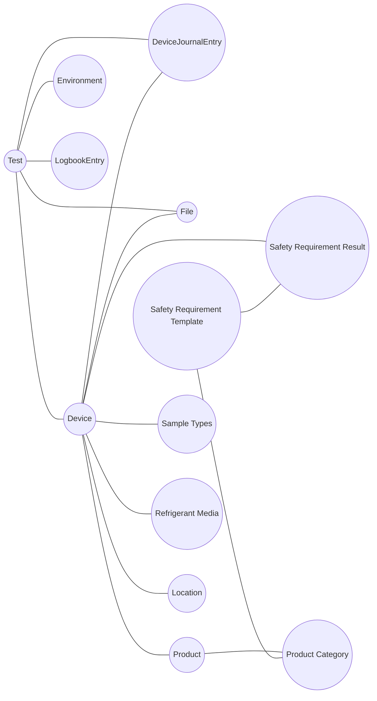

# Domain Model – Test Manager System - Phase 2 (v1)

**Author:** Patrick Mira
**Customer reviewers:** Sven Paulick, Tommy Oelschlägel
**Status:** Reviewed
**Purpose:**
This document defines the logical domain model for the **Test Manager System – Phase 2**. Its goal is to provide a clear, shared understanding of the key entities, their relationships, and the business rules that apply. It is **not a technical database schema or API design**, but a conceptual agreement to ensure alignment on what will be implemented in this phase 2 before development begins.

---

## 1) Conceptual Domain Map

*(High‑level business concepts and relationships; no fields yet.)*

**Glossary**

* **Test:** Central execution record. Holds config, status, timestamps, links, and files.
* **Device:** The **Device Under Test** — considered the "sample" in this domain. Stores product strings, sample type/number, and location of the sample.
* **Environment:** The **Test Environment** facility used during Tests. **(Placeholder on this Phase 2)**
* **File:** Blob storage item (id, name, url, size, uploaded_at) attached to **Test**, **Device** and **Environment**.
* **DeviceJournalEntry:** Timestamped log entry for changes, checks, and events on a Device. Can be auto-generated on Device modifications or manually created by users. Category is optional; text is required.
* **Safety Requirement Template / Result:** Product-specific checklist items and per-Device outcomes.
* **Product (lookup):** Manufacturer + Product category + Product name; **strings are stored on Device**, not foreign keys.
* **ProductCategory (lookup):** Product category with `requires_refrigerant` flag; **strings are stored on Device**, not foreign keys.
* **Sample Types (lookup):** Allowed values (e.g., PFP, FP, A, B, …) used to pick `sample_type`. Together with the manual entry of `sample_nr` it forms the `sample_id` identifier for the Device; **strings are stored on Device**.
* **RefrigerantMedia (lookup):** Refrigerant medium names (e.g., R32, R410A, R134a, R290, R744); **strings are stored in Device.refrigerant.medium** via non-editable dropdown.
* **Location (lookup):** Location names (e.g., Bench 3, Site A, Lab 2); **strings are stored in Device.location** via non-editable dropdown.

---

## 2) Logical ERD (entities, key attributes, cardinalities)

```mermaid
erDiagram
  %% Cardinalities and relationship semantics
  Device ||--|| Refrigerant : contains
  Device ||--o{ DeviceJournalEntry : has
  Device ||--o{ File : has
  Product ||..|| Device : lookup_for_strings
  ProductCategory ||..|| Device : lookup_for_strings
  ProductCategory ||..|| Product : lookup_for_strings
  SampleTypes ||..|| Device : lookup_for_strings
  RefrigerantMedia ||..|| Refrigerant : lookup_for_strings
  Location ||..|| Device : lookup_for_strings
  Device ||--o{ SafetyRequirementResult : evaluated_by
  SafetyRequirementTemplate ||--o{ SafetyRequirementResult : sources_checks
  ProductCategory ||..|| SafetyRequirementTemplate : lookup_scope
  Test ||--o{ Device : tests_multiple
  Test ||--o{ LogbookEntry : has
  Environment ||--o{ Test : config_of
  Test ||--o{ File : has

  Device {
    string  id PK                           "Device identifier (aka device_id)."
    enum    status                          "created|setup|stored|scrapped — operational state."
    string  status_note                     "Free text explaining status."
    datetime created_at                     "Creation timestamp (audit)."
    datetime updated_at                     "Last update timestamp (audit)."
    string  creator                         "Who created the Device."
    string  last_editor                     "Who edited most recently."

    %% Product-related (strings only; chosen via lookups)
    string  manufacturer                    "Manufacturer (Product lookup)."
    string  product_category                "Product category (ProductCategory lookup)."
    string  product_name                    "Product Name (Product lookup)."
    string  product_type                    "Product Type (Device lookup or manual) (optional)."
    string  product_variant                 "Product Type Variant (Device lookup or manual) (optional)."
    string  product_key                     "Product Type Key (Device lookup or manual) (optional)."

    %% Sample-related (strings only)
    string  sample_type                     "Lookup value (e.g., PFP, FP, A, B…) (required)."
    string  sample_nr                       "User-entered sample number (optional)."
    string  sample_id                       "Derived = sample_type (+ '-' + sample_nr if sample_nr present)."
    string  teamcenter_serial_nr            "External serial reference (optional)."

    %% Organization info
    string  sample_owner                    "Person/team responsible for the sample (optional)."
    string  location                        "Human-readable bench/site name (Location lookup)."
    string  project                         "Free-text project; chosen via suggestions."
    string  picture_link                    "Link to picture folder (optional)."

    %% Misc metadata
    string  software_bundle                 "SW package/build identifier (optional)."
    string  hardware_link                   "Link/ID to hardware asset (optional)."
    string  comment                         "General notes (optional)."
    bool    attended_operation              "Calculated: true when all required safety requirements are checked, false otherwise."
    bool    unattended_operation            "Calculated: true when all safety requirements are checked, false otherwise."

    object  refrigerant                     "Embedded object with refrigerant details."
  }

  DeviceJournalEntry {
    uuid    _id PK                          "Journal entry id (aka device_version)."
    string  device_id FK                    "Back-reference to Device."
    datetime timestamp                      "When the entry was created."
    string  editor                          "User who made the change."
    enum    category                        "Safety Requirements|Refrigerant Circuit|Setup|Testing|Change-Location|HW Modification|SW Modification (optional)."
    string  text                            "Short human summary."
    json    data                            "Full JSON snapshot of the Device at this time."
  }

  Test {
    string  _id PK                          "Test identifier (aka test_id)."
    string  campaign_id                     "Business grouping id (optional)."
    array   devices                         "Array of Device references: [{device_id, device_version}] (required, at least one)."
    string  environment_id FK               "External Environment bench id (required)."
    uuid    environment_version FK          "Snapshot EnvironmentJournalEntry._id taken at start."
    string  operator                        "User who created/started the test."
    datetime created_at                     "Creation timestamp (audit)."
    datetime updated_at                     "Last update timestamp (audit)."
    json    sensors                         "Map: sensor_id → metadata (free-form)."
    string  config_id                       "App-internal config preset id."
    string  grafana_url                     "Dashboard link (optional)."
    enum    status                          "draft|in_progress|finished."
    datetime start                          "Set when status transitions to in_progress."
    datetime end                            "Set when status transitions to finished (>= start)."
  }

  LogbookEntry {
    uuid    _id PK                          "Log entry id."
    string  test_id FK                      "Back-reference to Test."
    datetime created_at                     "When this record was created."
    datetime timestamp                      "Event time being recorded."
    string  operator                        "User who wrote the entry."
    string  content                         "Free-text content."
    string[] sensor_ids                     "Related sensors (optional)."
  }

SafetyRequirementTemplate {
    uuid    _id PK                          "Template id (aka template_id)."
    string  product_category                "Scope product category (string; from ProductCategory lookup)."
    string  title                           "Short name of the requirement."
    string  description                     "Detailed instruction (optional)."
    bool    required                        "True if required for the product category."
}

  SafetyRequirementResult {
    uuid    _id PK                          "Result id."
    string  device_id FK                    "Evaluated Device."
    uuid    template_id FK                  "Reference to template."
    bool    passed                          "Outcome of the check."
    datetime checked_at                     "When it was checked."
    string  checked_by                      "Who performed the check."
    string  comment                         "Notes/observations (optional)."
    string  link                            "Link to picture, document, etc. (optional)."
  }

  File {
    uuid    _id PK                          "File id."
    string  name                            "Original filename."
    string  url                             "Blob storage URL (pre-signed)."
    int     size                            "Bytes."
    datetime uploaded_at                    "Upload timestamp."
  }

  Environment {
    string  _id PK                          "Environment identifier (aka environment_id)."
    string  name                            "Human-readable bench name."
    string  environment_id                  "Test Bench environment identifier."
    string  location                        "Physical location string."
  }

  Product {
    uuid    _id PK                          "Product catalog id."
    string  manufacturer                    "Manufacturer name."
    string  product_category                "Product category (ProductCategory lookup)."
    string  product_name                    "Product name."
  }

  ProductCategory {
    string  _id PK                          "Product category key (aka product_category) (e.g., Gas, WP, PV, Air, Oil)."
    string  name                            "Human-readable category name (e.g., Gas, Heat Pump, Photovoltaic, Ventilation, Oil)."
    bool    requires_refrigerant            "True if refrigerant circuit is applicable."
  }

  SampleTypes {
    uuid    _id PK                          "Lookup id."
    string  sample_type                     "Allowed sample type value."
  }

  RefrigerantMedia {
    uuid    _id PK                          "Lookup id."
    string  medium                          "Refrigerant medium name (e.g., R32, R410A, R134a, R290, R744)."
  }

  Location {
    uuid    _id PK                          "Lookup id."
    string  location                        "Location name (e.g., Bench 3, Site A, Lab 2)."
  }

  Refrigerant {
    bool    circuit_ready                   "Circuit is built/charged and ready."
    string  medium                          "Type of refrigerant gas (RefrigerantMedia lookup)."
    float   amount_kg                       "Charge amount in kilograms."
  }
```

**Modeling notes**

* **Test is the hub**. Tests reference **multiple Devices** being tested (via `devices` array) and the **Environment** they run on.
* **Multiple Devices per Test**: A Test can contain multiple Devices. Each entry in the `devices` array includes `{device_id, device_version}` to track both the Device and its snapshot at test start.
* **Device as sample**: The Device *is* the sample. `sample_type` and `sample_nr` are stored as strings; `sample_id` is derived as `"{sample_type}-{sample_nr}"`.
* **Product fields are strings** on Device: `manufacturer`, `product_category`, `product_name`, `product_type`, `product_variant`, `product_key`. UI uses **Product** and **ProductCategory** entities for cascaded filtering (Manufacturer → Category → Product). For Type/Variant/Key, UI provides suggestions from existing Device records matching the selected product, or allows manual entry.
* **Refrigerant requirement**: **ProductCategory** entity has `requires_refrigerant` flag. When Device references a product_category with this flag=true, refrigerant fields are mandatory.
* **Safety templates** depend on `product_category` string. The UI may filter these using the Product entity, but templates are keyed only by product category.
* **Location is a string**: Users pick from a Location lookup at create/update, but Device stores only the display string. It may be a test bench name (`Environment.name` / `Environment.location`) or another location. If a Test is started and the location is different from the one defined in the `Environment` entity, UI will prompt the user if he wants to update the location (among other related fields)
* **Project is a string with lookup**: Users can choose from existing Projects. Device persists only free-text.
* **Unified File entity**: **Test**, **Device** and **Environment** attach `File` records directly.
* **Lookup tables administration**: Lookup entities (Product, ProductCategory, Location, RefrigerantMedia, SampleTypes) and SafetyRequirementTemplate have no API/UI CRUD endpoints. These tables are maintained manually by an admin directly in the database.

---

## 3) Entity Contracts

### Test

**Purpose:** A record of a test execution, linking multiple Devices, one Environment, and describing the sensor configuration used.

**Identifiers:** `_id` (string) (aka `test_id`).

**Key attributes:**

* `campaign_id` (string) – business grouping id.
* `devices` (array of objects) – Array of `{device_id, device_version}` objects; required (at least one). Each `device_id` is a FK to **Device**, and `device_version` is a FK to **DeviceJournalEntry** snapshot taken at test start.
* `environment_id` (uuid) – FK to external **Environment**; required.
* `environment_version` (uuid) – FK to **EnvironmentJournalEntry**; internal. Snapshot when Test creation and/or status = in_progress.
* `operator` (string) – who triggered the action.
* `created_at` / `updated_at` (datetime) – audit.
* `sensors` (json map: sensor_id → metadata dict) – free-form.
* `config_id` (string) – selected config preset id (app-internal).
* `grafana_url` (string|null) – dashboard link.
* `status` (enum) – `draft|in_progress|finished`.
* `start` / `end` (datetime|null) – timing.

**Relationships:** has many `LogbookEntry`, has many `File` (attachments), tests multiple `Device` (via `devices` array), uses `Environment`.

**Rules & invariants:**

* `IN_PROGRESS` requires `start` set; `FINISHED` requires `end ≥ start`.

**Events:** created, started, finished, file_attached, link_added.

---

### Device (Device Under Test)

**Purpose:** Device being tested; stores product, sample, location.

**Identifiers:** `_id` (string) (aka `device_id`).

**Key attributes:**

* `status` (enum) – `created|setup|stored|scrapped`.
* `status_note` (string|null).
* **Product fields (strings)**: `manufacturer`, `product_category`, `product_name`, `product_type?`, `product_variant?`, `product_key?` – chosen via **Product Catalog** (hierarchical lookup: Manufacturer → Category → Product). For Type/Variant/Key, UI suggests values from existing Device records or allows manual entry.
* **Sample fields (strings)**: `sample_type` (required, lookup, e.g. PFP, FP, A, B…), `sample_nr` (optional, user entered), `sample_id` (derived = `{sample_type}` or `{sample_type}-{sample_nr}` if sample_nr present), `teamcenter_serial_nr` (optional, external serial reference).
* **Organization info**: `sample_owner` (string, optional) – person/team responsible for the sample; `location` (string) – from Locations list; can be a test bench or site; `project` (string) – suggested via Projects lookup; manual allowed; `picture_link` (string, optional) – link to picture folder.
* **Refrigerant** (object): `circuit_ready` (bool), `medium` (string), `amount_kg` (float).
* Audit: `created_at`, `updated_at`, `creator`, `last_editor`.

**Relationships:** `Test` references multiple `Device` instances (via `devices` array), has many `DeviceJournalEntry`, has many `File`, has many `SafetyRequirementResult`.

**Rules & invariants:**

* **Immutable fields**: Only `device_id`, `created_at`, and `creator` are immutable after creation. All other fields can be edited.
* **Refrigerant validation**: Lookup ProductCategory by `product_category`. If `ProductCategory.requires_refrigerant = true` → Device must have `refrigerant.circuit_ready` and `refrigerant.medium` and `refrigerant.amount_kg` populated.
* If `refrigerant.circuit_ready = true` → `refrigerant.medium` and `refrigerant.amount_kg` required.
* `status=setup` implies product and location fields present.
* **Status transitions**: Any user can change status to any value (created, setup, stored, scrapped). All transitions are allowed. Status changes are treated as regular Device updates and generate a journal entry with user comment. No additional business logic is associated with status in Phase 2.

**Events:** created, updated, file_attached, journal_added.

---

### Environment (Test Environment)

**Purpose:** Test bench / environment where samples are being Tested; out of scope for phase 2 but referenced.

**Identifiers:** `_id` (string) (aka `environment_id`).

**Key attributes:** `environment_id` (string, external).

**Relationships:** `Test` references `Environment`.

---

### File (shared)

**Purpose:** Blob storage attachment.

**Identifiers:** `_id` (uuid).

**Attributes:** `name` (string), `url` (string), `size` (int), `uploaded_at` (datetime).

**Relationships:** many files can belong to a `Test` or `Device`.

---

### DeviceJournalEntry

**Purpose:** Immutable log for Device.

**Identifiers:** `_id` (uuid) - Device journal entry identifier (aka `device_version`).

**Attributes:**

* `device_id` (string FK)
* `timestamp` (datetime)
* `editor` (string)
* `category` (enum, optional: Safety Requirements, Refrigerant Circuit, Setup, Testing, Change-Location, HW Modification, SW Modification)
* `text` (string, required)
* `data` (json) - complete snapshot of the Device object at this point in time

**Rules:** append-only. The `data` field contains a full JSON snapshot of the Device object, allowing version comparison by diffing different journal entry snapshots. The `category` field is optional; users may select from dropdown if desired, but comparison of journal snapshots provides sufficient information for Phase 2. Users can manually create journal entries (without modifying the Device) to add notes/observations; in this case `data` captures the current Device state.

---

### LogbookEntry (per Test)

**Purpose:** Timeline/notes for a Test.

**Identifiers:** `_id` (uuid).

**Attributes:**

* `test_id` (string FK)
* `created_at` (datetime)
* `timestamp` (datetime)
* `operator` (string)
* `content` (string)
* `sensor_ids` (list of strings)

**Rules:** append-only.

---

### SafetyRequirementTemplate (SRT)

**Purpose:** Defines safety checks keyed by product_category.

**Identifiers:** `_id` (uuid) (aka `template_id`).

**Attributes:**

* `product_category` (string, from ProductCategory lookup)
* `title` (string)
* `description` (string optional)
* `required` (bool)

**Relationships:** referenced by `SafetyRequirementResult`.

**Rules:** keyed only by product_category. No API/UI CRUD - maintained manually by admin in database.

---

### SafetyRequirementResult (SRR)

**Purpose:** Per Device evaluation of a SafetyRequirementTemplate.

**Identifiers:** `_id` (uuid).

**Attributes:**

* `device_id` (string FK)
* `template_id` (uuid FK)
* `passed` (bool)
* `checked_at` (datetime)
* `checked_by` (string)
* `comment` (string optional)
* `link` (string optional) - link to picture, document, etc.

**Rules:** references a template; template immutability/versioning strategy TBD.

---

### Product

**Purpose:** Defines products with manufacturer and category.

**Identifiers:** `_id` (uuid).

**Attributes:**
* `manufacturer` (string)
* `product_category` (string) - from ProductCategory lookup
* `product_name` (string)

**Relationships:** references `ProductCategory`.

**Rules:** UI filters by manufacturer, then category, then product. Device stores strings only. No API/UI CRUD - maintained manually by admin in database.

---

### ProductCategory

**Purpose:** Defines product categories and their refrigerant requirements.

**Identifiers:** `_id` (string) - the product category key (aka `product_category`) (e.g., Gas, WP, PV, Air, Oil).

**Attributes:**
* `name` (string) - human-readable category name (e.g., Gas, Heat Pump, Photovoltaic, Ventilation, Oil)
* `requires_refrigerant` (bool) - true if refrigerant circuit is applicable

**Relationships:** referenced by `Product` and `SafetyRequirementTemplate`.

**Rules:** `_id` is the business key for this entity; stored as `product_category` string in referencing tables. No API/UI CRUD - maintained manually by admin in database.

---

### Sample Types

**Purpose:** Lookup for Device.sample_type.

**Identifiers:** `_id` (uuid).

**Attributes:** `sample_type` (string).

**Rules:** No API/UI CRUD - maintained manually by admin in database.

---

### RefrigerantMedia

**Purpose:** Lookup for refrigerant media types.

**Identifiers:** `_id` (uuid).

**Attributes:**
* `medium` (string) - refrigerant medium name (e.g., R32, R410A, R134a, R290, R744)

**Relationships:** referenced by Device.refrigerant.medium

**Rules:** Non-editable dropdown list in UI. No API/UI CRUD - maintained manually by admin in database.

---

### Location

**Purpose:** Lookup for location names.

**Identifiers:** `_id` (uuid).

**Attributes:**
* `location` (string) - location name (e.g., Bench 3, Site A, Lab 2)

**Relationships:** referenced by Device.location

**Rules:** Non-editable dropdown list in UI. No API/UI CRUD - maintained manually by admin in database.

---

## 4) Data Dictionary (v0.7 – key fields)

| Entity                    | Field                  | Type     | Required      | Allowed values                      | Description                                                        | Example                 | Source          |
| ------------------------- | ---------------------- | -------- | ------------- | ----------------------------------- | ------------------------------------------------------------------ | ----------------------- | --------------- |
| Device                    | status                 | enum     | yes           | created, setup, stored, scrapped    | Operational state                                                  | setup                   | App             |
| Device                    | manufacturer           | string   | yes           | via lookup                          | Manufacturer name                                                  | ACME                    | Product         |
| Device                    | product_category       | string   | yes           | via lookup (ProductCategory)        | Product category                                                   | HeatPump                | ProductCategory |
| Device                    | product_name           | string   | yes           | via lookup filtered by category     | Product name                                                       | CoolerX                 | Product         |
| Device                    | product_type           | string   | no            | via Device lookup or manual         | Type                                                               | HVAC                    | Device/User     |
| Device                    | product_variant        | string   | no            | via Device lookup or manual         | Variant                                                            | VX                      | Device/User     |
| Device                    | product_key            | string   | no            | via Device lookup or manual         | Product key/code                                                   | CX-001                  | Device/User     |
| Device                    | sample_type            | string   | yes           | PFP, FP, A, B, … (lookup)           | PFP                                                                | Sample Types            |                 |
| Device                    | sample_nr              | string   | no            | —                                   | Sample number                                                      | 42                      | User            |
| Device                    | sample_id              | string   | yes (derived) | {sample_type} or {sample_type}-{sample_nr} if sample_nr present | Composite id | PFP-42 or PFP | Derived |
| Device                    | teamcenter_serial_nr   | string   | no            | —                                   | External serial reference                                          | TC-12345                | User            |
| Device                    | sample_owner           | string   | no            | —                                   | Person/team responsible for the sample                             | Team A / J. Doe         | User            |
| Device                    | location               | string   | yes           | via lookup (Location)               | Human location (bench/site/etc.)                                   | Bench 3                 | Location        |
| Device                    | project                | string   | no            | via lookup or manual                | Project name                                                       | Phoenix                 | Projects        |
| Device                    | picture_link           | string   | no            | —                                   | Link to picture folder                                             | https://...             | User            |
| Device                    | refrigerant            | object   | no            | —                                   | Refrigerant details (embedded object)                              | {...}                   | Lab             |
| Device.refrigerant        | circuit_ready          | bool     | yes           | —                                   | Whether refrigerant circuit is ready                               | true                    | Lab             |
| Device.refrigerant        | medium                 | string   | conditional   | via lookup (RefrigerantMedia)       | Refrigerant medium used                                            | R32                     | RefrigerantMedia|
| Device.refrigerant        | amount_kg              | float    | conditional   | —                                   | Amount of refrigerant in kg                                        | 2.8                     | Lab             |
| RefrigerantMedia          | medium                 | string   | yes           | —                                   | Refrigerant medium name                                            | R32                     | Admin           |
| Location                  | location               | string   | yes           | —                                   | Location name                                                      | Bench 3                 | Admin           |
| Test                      | devices                | array    | yes           | —                                   | Array of {device_id, device_version} objects representing Devices under test | [{device_id: "7aa1…", device_version: "8bb2…"}] | App |
| Test                      | environment_id         | string   | yes           | —                                   | Environment configuration used; environment derived via Environment.environment_id | env-9bb2              | External        |
| Test                      | status                 | enum     | yes           | draft, in_progress, finished        | State of test                                                      | in_progress             | App             |
| Test                      | start/end              | datetime | conditional   | —                                   | start required when in_progress; both when finished                | 2025-01-01T10:00Z       | App             |
| File                      | id                     | string   | yes           | —                                   | Blob id                                                            | f_123                   | Storage         |
| File                      | name                   | string   | yes           | —                                   | Original filename                                                  | coolerx-manual.pdf      | Client          |
| File                      | url                    | string   | yes           | —                                   | Pre-signed URL to download                                         | https://...             | Storage         |
| File                      | size                   | int      | yes           | —                                   | Size in bytes                                                      | 1048576                 | Storage         |
| File                      | uploaded_at            | datetime | yes           | —                                   | Upload timestamp                                                   | 2025-01-01T10:00Z       | Storage         |
| Product                   | manufacturer           | string   | yes           | —                                   | Manufacturer name                                                  | ACME                    | Admin           |
| Product                   | product_category       | string   | yes           | via lookup                          | Product category (ProductCategory lookup)                          | HeatPump                | ProductCategory |
| Product                   | product_name           | string   | yes           | —                                   | Product name                                                       | CoolerX                 | Admin           |
| ProductCategory           | _id (product_category) | string   | yes           | —                                   | Product category key                                               | WP                      | Admin           |
| ProductCategory           | name                   | string   | yes           | —                                   | Human-readable category name                                       | Heat Pump               | Admin           |
| ProductCategory           | requires_refrigerant   | bool     | yes           | —                                   | True if refrigerant circuit is applicable                          | true                    | Admin           |
| SafetyRequirementTemplate | product_category       | string   | yes           | via lookup                          | Scope product category                                             | WP                      | ProductCategory |
| SafetyRequirementTemplate | title                  | string   | yes           | —                                   | Short name of the requirement                                      | E-stop present          | QA              |
| SafetyRequirementTemplate | description            | string   | no            | —                                   | Detailed instruction                                               | Emergency stop...       | QA              |
| SafetyRequirementTemplate | required               | bool     | yes           | —                                   | True if required for the product category                          | true                    | QA              |
| SafetyRequirementResult   | passed                 | bool     | yes           | —                                   | Outcome of requirement                                             | true                    | QA              |
| SafetyRequirementResult   | checked_at             | datetime | yes           | —                                   | When the requirement was checked                                   | 2025-01-01T10:00Z       | QA              |
| SafetyRequirementResult   | checked_by             | string   | yes           | —                                   | Who checked the requirement                                        | J. Smith                | QA              |
| SafetyRequirementResult   | comment                | string   | no            | —                                   | Additional notes about the check                                   | Verified visually       | QA              |
| SafetyRequirementResult   | link                   | string   | no            | —                                   | Link to picture, document, etc.                                    | https://...             | User            |
| DeviceJournalEntry        | device_id              | string   | yes           | —                                   | Reference to Device                                                | device-7aa1             | App             |
| DeviceJournalEntry        | timestamp              | datetime | yes           | —                                   | When the journal entry was created                                 | 2025-01-01T10:00Z       | App             |
| DeviceJournalEntry        | editor                 | string   | yes           | —                                   | Who made the change                                                | J. Smith                | App             |
| DeviceJournalEntry        | category               | enum     | no            | Safety Requirements, Refrigerant Circuit, Setup, Testing, Change-Location, HW Modification, SW Modification | Type of change logged (optional) | Setup | App |
| DeviceJournalEntry        | text                   | string   | yes           | —                                   | Description of the change                                          | Updated sensor config   | User            |
| DeviceJournalEntry        | data                   | json     | yes           | —                                   | JSON snapshot of the Device object at this point in time; allows version comparison by diffing snapshots | {entire Device object}  | App             |
| LogbookEntry              | test_id                | string   | yes           | —                                   | Reference to Test                                                  | test-7aa1               | App             |
| LogbookEntry              | created_at             | datetime | yes           | —                                   | When the entry was created                                         | 2025-01-01T10:00Z       | App             |
| LogbookEntry              | timestamp              | datetime | yes           | —                                   | Timestamp of the logged event                                      | 2025-01-01T10:00Z       | User            |
| LogbookEntry              | operator               | string   | yes           | —                                   | Who created the logbook entry                                      | J. Smith                | App             |
| LogbookEntry              | content                | string   | yes           | —                                   | Logbook entry text                                                 | Test started normally   | User            |
| LogbookEntry              | sensor_ids             | string[] | no            | —                                   | Associated sensor identifiers                                      | ["temp_1", "press_2"]   | User            |
| SampleTypes               | sample_type            | string   | yes           | —                                   | Sample type identifier                                             | PFP                     | Admin           |
| Environment               | name                   | string   | yes           | —                                   | Test bench name                                                    | Bench 3                 | User        |
| Environment               | environment_id         | string   | yes           | —                                   | Test bench environment identifier                                    | ENV-001                 | User        |
| Environment               | location               | string   | yes           | —                                   | Physical location of test bench                                    | Lab Building A          | User        |

## 5) Scenarios (happy paths)

1. **Create Test (centered)**
   Choose one or more Devices → Choose Environment (from external system) → Server stores `devices` array (with each `{device_id, device_version}`) and `environment_id` (no environment on Test) → `status=draft`.

2. **Start Test**
   On transition to `in_progress`:
   * Set `start`.
   * Snapshot **all Devices and Environment** on the Test by storing the current `DeviceJournalEntry._id` for each Device in the `devices` array and `EnvironmentJournalEntry._id` in `environment_version` (pointing to the latest entries at this moment).
   * Create a Logbook entry capturing the Test start and the Device/Environment references.

3. **Finish Test**
   Set `end` and `status=finished` (validate `end ≥ start`).

4. **Create Device (happy path)**
   * Open "New Device".
   * Select **Manufacturer → Category → Product → (optional) Type/Variant/Key** via lookup; persisted on Device as strings.
   * Enter **Sample**: choose `sample_type` (from lookup) + input `sample_nr`; app derives `sample_id = {sample_type}-{sample_nr}`.
   * Choose **Location** (string from Locations list) and (optionally) **Project** (string with lookup suggestions).
   * If selected ProductCategory has `requires_refrigerant = true`, enforce:
     - `refrigerant.circuit_ready`, `refrigerant.medium`, and `refrigerant.amount_kg` are required.
   * If `refrigerant.circuit_ready = true`, require `medium` and `amount_kg`.
   * Set `status = created` (initial status on Device creation).
   * Persist Device.
   * **Create initial DeviceJournalEntry** with:
     - `category = Setup`
     - `text = "Device created"`
     - `data =` full JSON snapshot of the Device.
   * (Optional) Attach any initial files to the Device.

5. **Modify Device (happy path)**
   * Open existing Device.
   * Edit any field except `device_id`, `created_at`, and `creator` (which are immutable).
   * Note: `attended_operation` and `unattended_operation` are calculated fields based on safety requirements and cannot be edited directly.
   * Re-validate Refrigerant rules:
     - If the linked (string) ProductCategory implies `requires_refrigerant = true`, enforce refrigerant fields as above.
     - If `refrigerant.circuit_ready = true`, require `medium` and `amount_kg`.
   * Persist Device changes.
   * **Append DeviceJournalEntry** with:
     - `category` (optional) - user may select from dropdown (e.g., `Change-Location`, `HW Modification`, `SW Modification`, `Refrigerant Circuit`, `Testing`, `Setup`).
     - `text` summarizing the change (free-text, required).
     - `data` = full JSON snapshot of the updated Device.

6. **Create manual Device journal entry**
   * User can manually add a journal entry to an existing Device without modifying the Device itself.
   * **Append DeviceJournalEntry** with:
     - `category` (optional) - user may select from dropdown.
     - `text` (required) - user-provided notes/observations.
     - `data` = full JSON snapshot of the current Device (unchanged).

